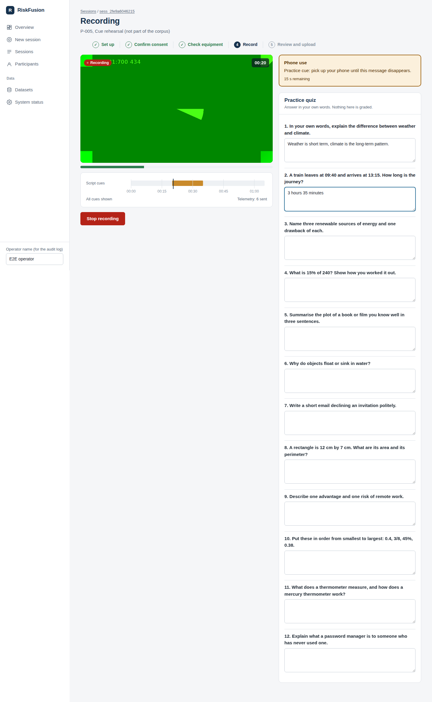

# RiskFusion

RiskFusion helps human reviewers decide **which online exam sessions deserve a closer look**. It combines
signals from video, audio and browser activity into a calibrated, explainable risk score. It produces
**review recommendations only, never verdicts** (SRS CON-5, ETH-6).

This repository is the working prototype built phase by phase from `SRS v2.0`. It currently covers
**Phase 0 and Phase 1**:

- a web dashboard and API for consent, real webcam recording of mock sessions, and browser telemetry;
- a PostgreSQL store with a full audit trail;
- the session simulator (5,000 labelled sessions in about 2 minutes);
- the DR-4 label store;
- leakage-safe splits with a sealed holdout.

Detectors, features, models, explanations and reports are Phases 2–7 and are **not built yet**. The dashboard
says so where they will appear rather than showing placeholders. See `docs/IMPLEMENTATION_PLAN.md` and
`docs/TRACEABILITY.md` for the exact status of every requirement.



## Quick start (local)

Requirements:
- Python 3.10+
- Node 20+
- PostgreSQL 14+
- ffmpeg (from Phase 2)
- Chrome, Edge or Firefox to record

```bash
cp .env.example .env              # adjust RISKFUSION_DATABASE_URL if needed
make install                      # Python + frontend dependencies
make db                           # role + databases riskfusion and riskfusion_test
make migrate                      # schema (Alembic)
make simulate                     # 5,000 sessions -> data/synthetic/ (≈2 min, 1.2 GB)
make register                     # sessions, labels, splits -> PostgreSQL
make api                          # terminal 1: http://127.0.0.1:8000  (OpenAPI at /docs)
make web                          # terminal 2: http://localhost:5173
```

`make simulate` reproduces the committed dataset exactly: same seed, same content hash
(`8815f892…`). The splits in `data/splits/` and their sealed-holdout manifest are committed and must not be
regenerated. `make splits` refuses to overwrite them by design.

### With Docker

```bash
docker compose up --build         # dashboard on http://localhost:8080
```
The compose file starts PostgreSQL, the API (which runs migrations on start) and the dashboard behind nginx.
To use simulated data, run `make simulate` on the host (it writes to `./data`, mounted into the API), then
`docker compose exec backend python scripts/register_dataset.py sim-v1-s20260923-n5000`.
*The Docker files were written and reviewed but could not be built in the development environment. Please
report any problem.*

## Recording a mock session

Follow `docs/MOCK_PROTOCOL.md`. In short:

1. **Participants → Register participant** (confirm 18+). The participant then reads and signs the consent form.
2. **New session**: choose the participant, a script and the real room conditions, then confirm consent.
3. **Check equipment**: camera, microphone level, and the enrolment photo.
4. **Record**: the participant answers the practice quiz and follows the on-screen cues. Stop, review, upload.

The recording is stored with its SHA-256. The ground-truth label is created from the script schedule, and the
session page shows playback, a timeline of truth, cues and telemetry, and the full status history.

Use the *Cue rehearsal* script for a two-minute test that does not count toward the corpus.

## Tests

```bash
make test        # 44 unit + integration tests against PostgreSQL (database riskfusion_test is rebuilt)
make e2e         # full browser run with Chromium's synthetic camera: consent → record → cue → upload
make lint        # ruff + strict TypeScript
```

The end-to-end test drives the real `getUserMedia → MediaRecorder → upload` path. It then checks the
stored WebM header, the telemetry (including paste length) and the label through the API.

## Repository layout

```
src/riskfusion/          data-science package: contracts, simulator, splits, CLI
backend/riskfusion_api/  FastAPI service: models, routers, services, storage
frontend/                React + TypeScript dashboard
configs/                 simulator config (v1.yaml), mock scripts
contracts/               generated JSON Schemas (event.v1, risk_assessment.v1)
migrations/              Alembic migrations
data/splits/             committed split manifests + holdout access log
docs/                    SRS audit, plan, traceability, data dictionary, metrics, protocol, consent form
tests/                   unit, integration (PostgreSQL), e2e (browser)
```

## Measured results so far

- Simulator: 5,000 sessions and 68.9M events in 125 s on 1 vCPU, with 0 rejected events and a 6.44% violation rate (SRS range 3–8%).
- Splits: train 2,998, validation 651, calibration 601, sealed holdout 750. The violation rate is 6.4–6.5% in each, and every profile appears in every split. Holdout accesses so far: 0 of 2.
- API: list and overview endpoints respond in about 40 ms over 5,000 sessions. A single simulated session's signal timeline is read from Parquet in about 0.3 s.

## Important limitations

- The simulator's detector error rates are the SRS's **unmeasured planning estimates** (DR-3), made more pessimistic. FR-6 replaces them with rates measured on the mock corpus.
- There is no login. The prototype is for local use by the project team. The operator name typed in the sidebar is recorded in the audit log (see `docs/SRS_AUDIT.md`, A-20).
- Monitor count is only observable in Chromium browsers; elsewhere it is recorded as unknown.
