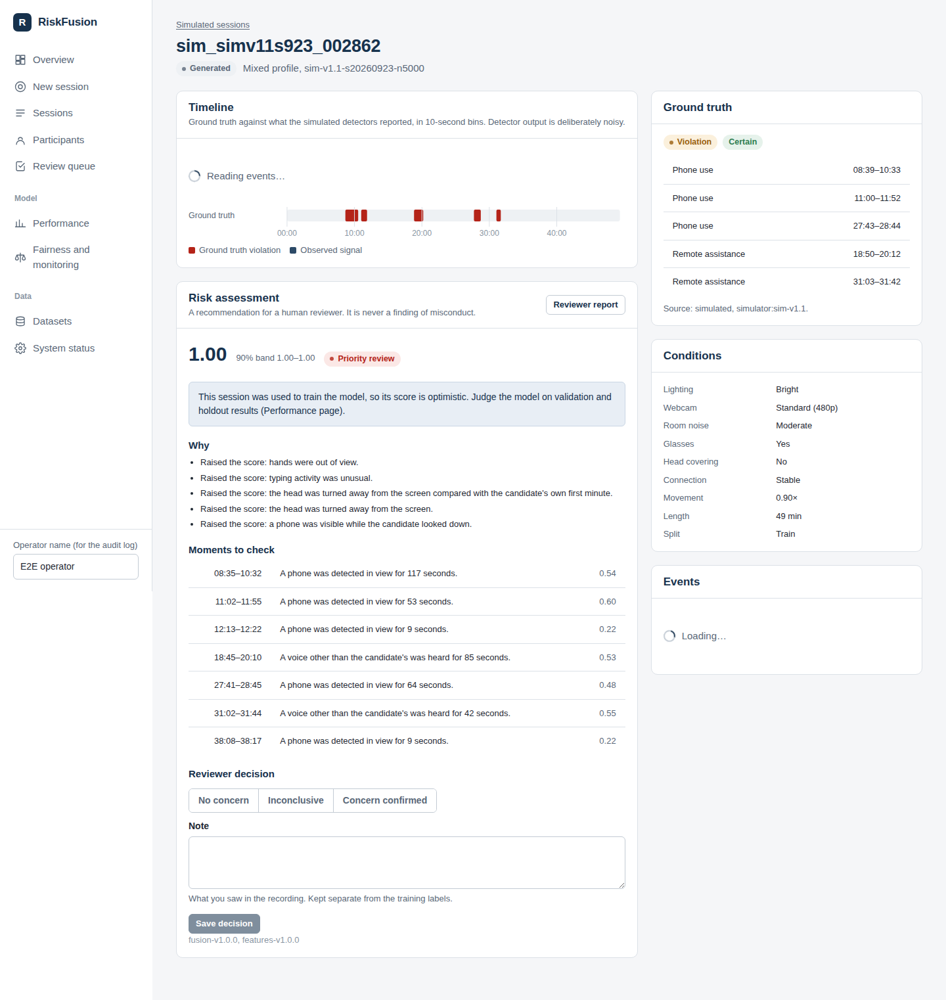

# RiskFusion

RiskFusion helps human reviewers decide **which online exam sessions deserve a closer look**. It fuses signals from
video, audio and browser activity into a calibrated, explainable risk score and a review recommendation. It never
produces a verdict (SRS CON-5, ETH-6).

This is the complete prototype built from SRS v2.0, Phases 0–7:
- **Recording:** consented mock-session recording from the browser.
- **Signal extraction:** pretrained detectors applied to the recordings.
- **Data:** a 5,000-session simulator and a versioned feature store.
- **Models:** a fusion model with calibration, explanations and time-bounded flags.
- **Evaluation:** fairness and robustness evaluation, and a drift monitor.
- **Serving:** a scoring API, reviewer HTML reports, and a review queue with reviewer decisions.
- **Dashboard:** a web dashboard covering all of the above.

Start with `docs/FINAL_REPORT.md` and `docs/MODEL_CARD.md`.



## Results (sealed holdout, 750 sessions)

| | Fusion model | Rule baseline | SRS target |
|---|---|---|---|
| PR-AUC | **0.835** (95% CI 0.73–0.92) | 0.343 | ≥ +15% over baseline |
| Recall at operating point | **84%** | 31% | ≥ 80% |
| Calibration error (ECE) | **0.016** | 0.232 | < 0.05 |
| Missing channel raises a score | **never** (guaranteed) | — | never |
| FPR disparity across conditions | 1.15–2.05 | — | < 1.3 (**not met**) |

These are results on **simulated data**. See the limitations in the model card.

## Quick start

Requirements:
- Python 3.10+, Node 20+, PostgreSQL 14+ and ffmpeg.
- Chrome, Edge or Firefox for recording.
- About 3 GB of disk space.

```bash
cp .env.example .env
make install          # Python + frontend dependencies
make db               # PostgreSQL role and databases
make pipeline         # models, data, features, training, evaluation, scoring (~12 min)
make api              # terminal 1: http://127.0.0.1:8000   (OpenAPI: /docs)
make web              # terminal 2: http://localhost:5173
```

`make pipeline` is the one-command reproduction (FR-39). It regenerates the datasets from fixed seeds,
rebuilds features, retrains and re-evaluates. `make reproduce` checks the retrained metrics against the committed
model: they match to 0.00 percentage points. The trained model, evaluation reports and experiment log are committed,
so the dashboard and API work before you run the pipeline. Only the simulated-session views need the generated
data.

Docker: `docker compose up --build` gives the dashboard on http://localhost:8080. The Docker files were written
but could not be built in the development environment.

## Using it

1. **Record** (`docs/MOCK_PROTOCOL.md`): register an adult participant, record consent, create a session, check the
   equipment, take the enrolment photo, record, then upload.
2. **Analyse:** starts **automatically when the recording is uploaded** (or press *Analyse recording*). All 11
   channels are extracted in one pass — face presence, identity, liveness, head pose/gaze, people and objects,
   body pose and hands, speech and other voices, audio events, plus the browser's screen, device and typing
   telemetry — then features and the risk model. You get a risk score, a 90% band, a review tier, reasons, moments
   to check, a signal timeline and an HTML report.
3. **Review:** the *Review queue* orders scored sessions by risk. Record a decision; decisions are stored apart
   from training labels, and the overturn rate is tracked.
4. **Measure** (FR-3, FR-6): with 20 or more analysed mock sessions, `POST /corpus/validate` measures real detector error
   rates, compares the simulator with your recordings, and writes `configs/simulator/v2_measured.yaml`.

**API:**
- `POST /score` takes event.v1 events and returns a risk_assessment.v1.
- `GET /model-info` and `GET /health`.
- Batch scoring: `riskfusion score-dir <input-dir> <output-dir>` (files named `<session_id>.jsonl`), which writes
  assessments and HTML reports.

## Tests

```bash
make test     # 64 unit + integration tests against PostgreSQL, including a real video through the whole pipeline
make e2e      # browser test with Chromium's synthetic camera: consent -> record -> analyse -> review
make lint     # ruff, mypy, strict TypeScript
```

## Layout

```
src/riskfusion/     contracts, simulator, extract (detectors), features, modeling, validation, serving, CLI
backend/            FastAPI service (PostgreSQL, storage, background analysis)
frontend/           React + TypeScript dashboard
configs/            simulator versions, mock scripts, baseline weights
models/trained/     the deployed model bundle
reports/evaluation/ evaluation, fairness, robustness, drift, holdout results
runs/               experiment log
data/splits/        split manifests + sealed-holdout access log (committed)
docs/               SRS audit, plan, traceability, model card, final report, data dictionary, metrics, protocol
```

## Important limitations

- Trained on simulated data with estimated detector error rates. The consented mock corpus (60 sessions) still
  has to be recorded before FR-3 and FR-6 can run on real volunteers.
- Some detectors are heuristics (speaker, blink-based liveness, audio events, head-pose gaze). Body pose needs the
  elbows in view; with a head-and-shoulders webcam it is reported unavailable, which never raises a score.
- False alerts are higher for head-covered candidates and unstable connections. Read FINAL_REPORT §4 before any use.
- There is no authentication; the prototype is for local research use.
